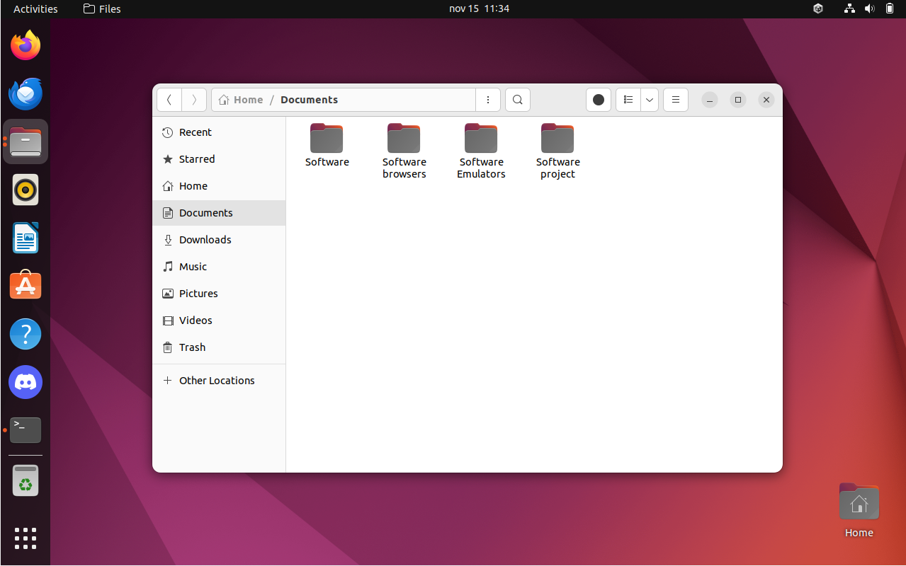
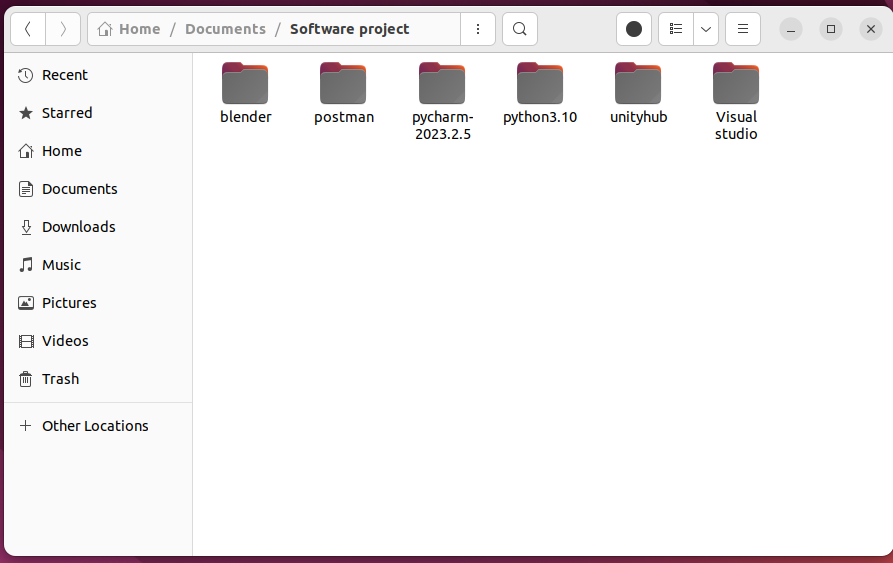
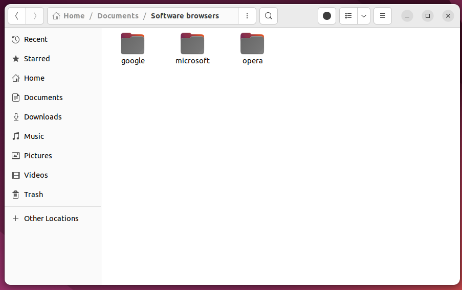

# Job Gevels
Job Gevels is een Game developer,

Maak een linux systeem gereed voor hem.
Hieronder zie je wat je allemaal voor Job Gevels moet doen.

## Device
* Voor dit profiel installeren en gebruiken we Linux ubuntu(versie Ubuntu 22.04.3 LTS).

_2 Blocks_

## Software
Deze software moet geinstalleert worden voor dit profiel op ubuntu:

* Visual studio code
* Unity
* Blender
* Aseprite
* Chrome
* Microsoft edge
* WinVICE Commodore 64 emulator
* WinVICE Commodore 128 emulator
* Discord
* Opera Browser(niet GX)
* Postman
* android emulator 
* python 
* Spotify 
* Pycharm

_5 Blocks_

## File management
Files sorteren

voorbeelden :

_5 Blocks_

## Scripting
Opdracht: Game script

Maak een simpele game met het gebruik van visual studio of pycharm.

_5 Blocks_

## PowerShell
Opdracht: Steam Game Link Generator

Doel: Ontwikkel een PowerShell-script dat de gebruiker vraagt om de naam van een game in te voeren, waarna het script automatisch een link genereert naar de Steam-pagina van de opgegeven game en deze opent in de standaardwebbrowser.

_7 Blocks_